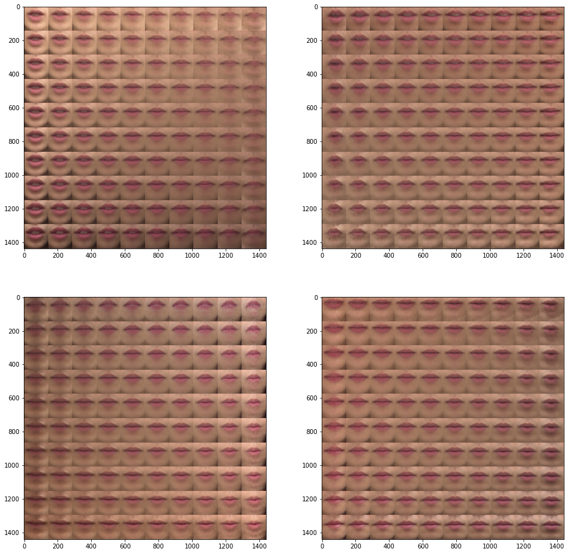

# SSRW_2018
## Codes for Competition SSRW2018 which was held by saitoh@kyutech.ac.jp

* Info of the competition(Japanese) : [SSRW2018](http://www.slab.ces.kyutech.ac.jp/SSRW2018/competition.html)
** Split 25 class to detect which the Japanese-word speakers says
** Input is time-sliced mouse images (300x300xRGB, Jpeg format)
** Train data: 36speakers x 25words x 30 iters
** Test data: 5000 iters of variable speaker/words
** Each iters have variable number of time-series images(max 121)
** Evaluation criteria: Accuracy of top_k(25,1) classification of Test data

## What the codes does
* Step1: Dimensionality reduction with VAE
** Trim center 144x144x3 of each images to avoid impacts of background difference
** Split each images with VAE
** Output 16 time-series variables for each iters of Train/Test datas
** Append label data for Step2(Train data only)
** Using keras because of the ease of use of ImagedataGenerator and Model classes
* Step2: Classification with RNN
** Classification from Step1 data to 25 classes
** With simple GRUcell 1-layer
** Using tensorflow because of the ease of use of variable-length RNN

## Achievement
* 30.0% accuracy in validation
* 26.6% accuracy in test

## Result in my environment
* Step1

* Step2

## Environment
* Core i7 2600K + RAM12GB + GTX1060(6GB)
* Windows10+Python3.6+Tensorflow/Keras+Jupyter notebook
* Step1:8Hour, Step2:10min
